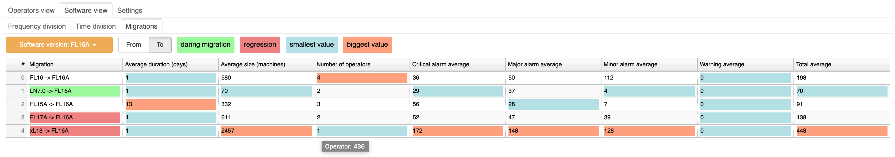
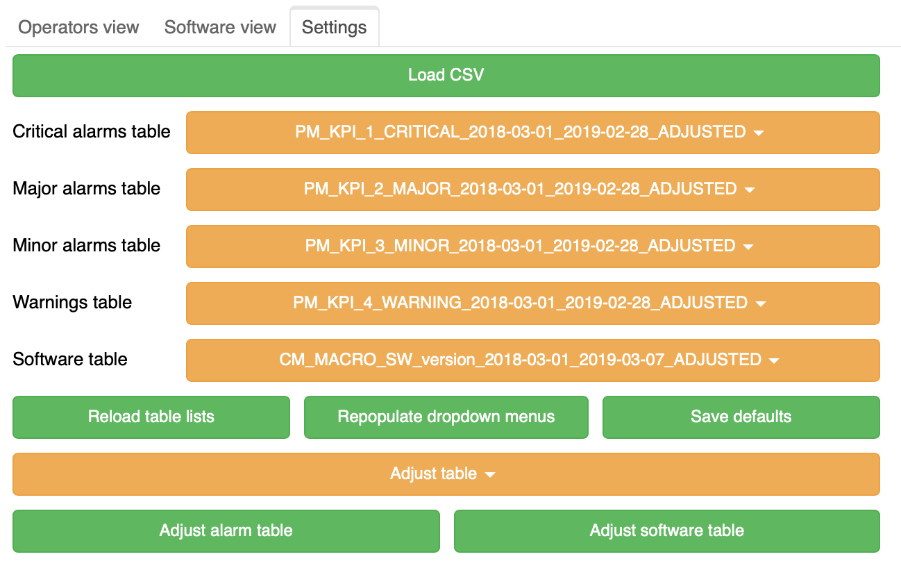

# innovativeproject-network-evolution


A helper tool that makes network evolution analysis a breeze.

- [DEPENDENCIES](#dependencies)
- [FEATURES](#features)
- [METRICS](#metrics)
- [HOW TO USE](#how-to-use)
- [ADDITIONAL INFO](#additional-info)

## DEPENDENCIES
You'll need Python 3.7.3 or newer (since Numpy likes to throw a hissy fit on 3.6.X and lower). The libraries below are necessary and can be installed via pip:  
```
$ pip3 install psycopg2==2.8.3
$ pip3 install bokeh==1.2.0
```
The dependencies can also be installed the easy way once you clone the repository:
```
$ pip3 install -r requirements.txt
```
You will also need to have access to a PostgreSQL instance: we tested version 11.3 ourselves, but any other recent release should be fine as well.

## FEATURES
- A fast, interactive graphical interface
- Automatic calculation and visualization of all statistics
- Numerous different views on the information gathered from input
- Allows you to load any amount of data
- Data adjustment to make up for imperfect input data

## METRICS
### Operators View


Allows you to view all gathered data in regard to any chosen operator. The main plot shows how many machines with a specific software the operator had in his network in the chosen interval of time. The default interval is 2 years. The plot can be interacted with and any lines can be turned on and off (by clicking on the corresponding items in legend) to allow for easier viewing of changes in the amount of specific software installed. You can hover over any spot in the plot to view data for the specific moment in time. Stacked graph version is also available to allow viewing a different representation of presented data.

### Migrations

On the right you can see a table which lists all detected migrations of softwares in the main plot. Migration is a continuous event describing the change of installed software on the used machines in the network. The ‘duration’ statistic is calculated by subtracting the first date when a specific software migration was detected from the last day when the same migration was detected. ‘Alarms’ statistic lists how many alarms were detected which occured in dates close to the dates of migrations. ‘Size’ simply states how many machines were taking part in a specific migration. The fields in the table are colored to indicate some facts about the migrations. Daring migration means that the migration went a few (at least 3) software versions ahead, instead of just migrating to the next version of the software. Regression means that the migration changed to a software that was older than the one already installed. 

### Software statistics

In 'Software view' you can find metrics dedicated to all software rather than to a specific operator. Software is divided into 'Frequency division' and 'Time division' tabs, in which you can find statistics dedicated to specific group of software. At the top of the page you can find a short rundown of statistics depicted in the graphs. The ‘Failure frequency’ graph depicts how many alarms specific softwares cause in relation to each other. The data is calculated based on information gathered from all available operators. It is worth noting that the data is based on both the alarms that occurred during migrations and the alarms that occurred outside of them. The numeric values on bars have specific meaning. They say how many alarms would occur on average during 30 days if you had a network with 100 machines with the specific software installed on them. The 'Lifespan' bar graph depicts how many days on average was specific software used in any network. For the sake of calculations we assumed that a software was used in a network during given day if at least 1% of all machines that day had the specific software installed on them.

### Software Migrations

This table combines all the data gathered from calculating migrations for all available operators. You can choose to view migrations of any chosen software using the provided interface, allowing for easy data lookup. Most of the values in the table are averages of migrations found in networks. The table also features statistic ‘Number of operators’, which shows in how many different networks was the given migration found. The list of those specific networks is also available by hovering over the 'Number of operators' field. The table is colored in the same fashion as in 'Migration' tab available in 'Operators view'.

### Settings

From this tab you can adjust settings of the program to your needs. In case you have your tables in a CSV format, you can load them into PostgreSQL without bringing up the console. **Note that the tables you use should be adjusted before using via the buttons on the bottom - this will fill empty gaps in the data, effectively making graphs more readable and the computation of migrations more reliable.** The dropdowns specify which tables to use throughout the program. If the database schema changed during runtime, you can reload table lists. Similarly, if you made a selection in the dropdowns, you'll have to repopulate menus to show correct values in operator and software pickers. You can also save your settings to be used the next time you open the program.

## HOW TO USE
In order to use the program, clone the repository, install all the dependencies, point the program to a PostgreSQL instance in the `PSQL` section of the `config.ini` file, optionally change the default names of tables you'd like to read data from and finally type:
```
$ bokeh serve --show gui.py
```
Now the server can be accessed through your favourite browser via `localhost:5006/gui`.

If the program seems to be unable to access the database, make sure that incoming connections are allowed (see: `pg_hba.conf`) and being listened to (see: `postgresql.conf`).

If you'd rather use Docker, clone the repository and type
```
$ docker build --tag=network-evolution .
```
This will create a docker container, which can be invoked with
```
$ docker run network-evolution
```
Now the server can be accessed through your favourite browser via `0.0.0.0:5006/gui`. If you prefer to run the server in a detached state, use the `-d` option.

Note that you might need to forward port 5006 to access the container. This can be achieved by using a `-p 5006:5006` option in the `docker run` command.

Additionally, in order to access a PostgreSQL database running on your local machine from the container you will need to perform some additional steps, depending on your operating system (at least until the pull request no. #2348 of docker/libnetwork gets accepted).

On Linux, adding `--network="host"` to the `docker run` command will suffice, as it will bridge network interfaces of host machine and the container.

Since Docker on MacOS and Windows runs slightly differently, you will instead need to set the host variable in `PSQL` section of `config.ini` to `host.docker.internal`, which will promptly resolve to the host's local network via Docker's NAT service.

## ADDITIONAL INFO
The project was tested on macOS 10.14.5 Mojave, using Python version: 3.7.3 and PostgreSQL version: 11.3.
